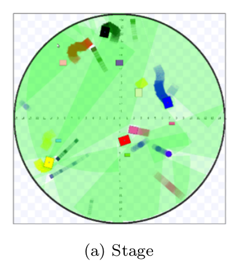
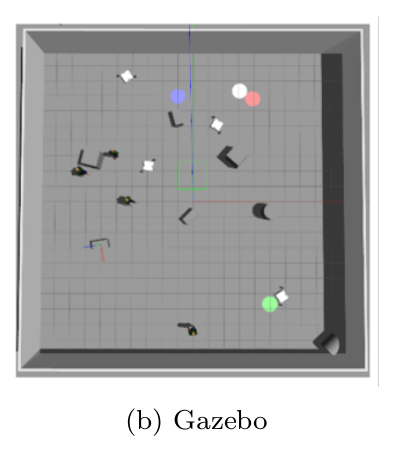

# Mobile-robot Collision Avoidance Learning 정리

# Overview

---

- To navigation on the complex environment, The Deep Reinforcement Learning can be attractive method better than classical methods. `rl_local_planner` inherits MRCA(Multi-robot collision avidance) methodology, which is based on  PPO(Proximal Policy Optimization and Stage simulation. In our case, we adopt PPO as state-of-art Model-Free algorithm and trained on the physical simulation to be considered with real world properties. The training time are decreased by replacing with off-policy. The off-policy could be more sample efficient because of multi agents environment.
- The `rl_local_planner` is already tested on real logistic robot and ported the ROS but not local planner planner. For practical usages, `rl_local_planner` included the global_planner and selected the sub goal concept as look ahead, called MCAL(Mobile robot Collision Avoidance Learning)  similar with Hybrid-MRCA.

[https://www.youtube.com/watch?v=ACG4TMenJDs&t](https://www.youtube.com/watch?v=ACG4TMenJDs&t)

# Requirement

---

- python 2.7
- ROS Kinetic & Melodic
- mpi4py
- Stage
- Gazebo
- PyTorch

# Mobile-robot Collision Avoidance Learning

---

# Stage world

---



## How to Train

---

Please use the stage_ros-add_pose_and_crash package instead of the default package provided by ROS.

```jsx
mkdir -p catkin_ws/src
cd catkin_ws/src
git clone https://github.com/CzJaewan/rl_local_planner.git
cd ..
catkin_make
```

To train, modify the hyper-parameters in sac_main.py as you like, and running the following command:

```jsx
cd catkin_ws/src/rl_local_planner/stage_ro-add_pose_and_crach/
rosrun stage_ros_add_pose_and_crash stageros_w worlds/stage1.world
mpiexec -np 6 python sac_main.py
```

## How to Test

---

```jsx
rosrun stage_ros_add_pose_and_crash stageros worlds/circle.world
mpiexec -np 50 python circle_test.py
```

# Gazebo world

---



## How to Train

---

Please use the stage_ros-add_pose_and_crash package instead of the default package provided by ROS.

```jsx
mkdir -p catkin_ws/src
cp stage_ros-add_pose_and_crash catkin_ws/src
cd catkin_ws
catkin_make
source devel/setup.bash
```

To train, modify the hyper-parameters in sac_main.py as you like, and running the following command:

```jsx
rosrun stage_ros_add_pose_and_crash stageros worlds/stage1.world
mpiexec -np 6 python sac_main.py
```

## How to Test

---

### 1. Run Gazebo simulator

```jsx
#empty world
roslaunch sp_gazebo scan_merged_sr7e_rl_gazebo.launch

#obstacle world
roslaunch sp_gazebo scan_merged_sr7e_rl_static_2_gazebo.launch
roslaunch sp_gazebo scan_merged_sr7e_rl_static_4_gazebo.launch
roslaunch sp_gazebo scan_merged_sr7e_rl_d35m_gazebo.launch
roslaunch sp_gazebo scan_merged_sr7e_rl_dc_gazebo.launch
roslaunch sp_gazebo scan_merged_sr7e_rl_df_gazebo.launch

```

### 2. Run RL navigation

### without Look ahead (mcal)

1. modify import world file of gazebo_test_sac.py 

    ```jsx
    cd ~/catkin_ws/src/rl_local_planner/mcal_gazebo/GAZEBO_TEST_SAC/single
    gedit gazebo_test_sac.py
    ****************************************************
    from syscon_gazebo_test_amcl_world import StageWorld
    ```

2. run roslaunch file & runfile 

    ```jsx
    roslaunch gazebo_rl_test sysconbot_rl.launch
    cd ~/catkin_ws/src/rl_local_planner/mcal_gazebo/GAZEBO_TEST_SAC/single
    mpiexec -np 1 python gazebo_test_sac.py
    ```

### with Look ahead (mcal_p)

1. modify import world file of gazebo_test_sac.py 

    ```jsx
    cd ~/catkin_ws/src/rl_local_planner/mcal_gazebo/GAZEBO_TEST_SAC/single
    gedit gazebo_test_sac.py
    ****************************************************
    from syscon_gazebo_test_amcl_world_LAH import StageWorld
    ```

2. run roslaunch file & runfile 

    ```jsx
    roslaunch gazebo_rl_test sysconbot_rl_lookahead_2.launch
    cd ~/catkin_ws/src/rl_local_planner/mcal_gazebo/GAZEBO_TEST_SAC/single
    mpiexec -np 1 python gazebo_test_sac.py
    ```

### with Look ahead & hybrid mode (hybrid mcal_p)

```jsx
roslaunch gazebo_rl_test hybrid_syscon_navigation.launch
cd ~/catkin_ws/src/rl_local_planner/mcal_gazebo/GAZEBO_TEST_SAC/single
mpiexec -np 1 python gazebo_test_sac.py
```

1. modify import world file of gazebo_test_sac.py 

    ```jsx
    cd ~/catkin_ws/src/rl_local_planner/mcal_gazebo/GAZEBO_TEST_SAC/single
    gedit gazebo_test_sac.py
    ****************************************************
    from syscon_gazebo_test_amcl_world_LAH_hybrid import StageWorld
    ```

2. run cmd_vel_swich node

    ```jsx
    cd ~/catkin_ws/src/rl_local_planner/navigation/script
    python hybrid_cmd_vel_swich.py
    ```

3. run roslaunch file & runfile 

    ```jsx
    roslaunch gazebo_rl_test hybrid_syscon_navigation.launch
    cd ~/catkin_ws/src/rl_local_planner/mcal_gazebo/GAZEBO_TEST_SAC/single
    mpiexec -np 1 python gazebo_test_sac.py
    ```

## How to Test (multi-agent)

---

### 1. Run Gazebo simulator

```jsx
# 2 agent
roslaunch sp_gazebo scan_merged_sr7e_rl_2agent.launch

# 4 agent
roslaunch sp_gazebo scan_merged_sr7e_rl_4agent.launch
```

### 2. Run RL navigation

localization, global planner, costmap, map run

```jsx
# 2 agent
roslaunch gazebo_rl_test multi-sysconbot_rl_lookahead_2.launch

# 4 agent
roslaunch gazebo_rl_test multi-sysconbot_rl_lookahead_4.launchy
```

rl based collision avoidance and driving controller run

```jsx
# 2 agent
cd ~/catkin_ws/src/rl_local_planner/mcal_gazebo/GAZEBO_TEST_SAC/multi
mpiexec -np 2 python gazebo_1_multi_test_sac.py
or
mpiexec -np 1 python gazebo_1_multi_test_sac.py
mpiexec -np 1 python gazebo_2_multi_test_sac.py

# 4 agent
cd ~/catkin_ws/src/rl_local_planner/mcal_gazebo/GAZEBO_TEST_SAC/multi
mpiexec -np 4 python gazebo_1_multi_test_sac.py
or
mpiexec -np 1 python gazebo_1_multi_test_sac.py
mpiexec -np 1 python gazebo_2_multi_test_sac.py
mpiexec -np 1 python gazebo_3_multi_test_sac.py
mpiexec -np 1 python gazebo_4_multi_test_sac.py
```

### Real world test

### References:

[dCollection 디지털 학술정보 유통시스템](http://snut.dcollection.net/srch/srchDetail/200000372623?ajax=false&start=0&query=%28ins_code%3A211034%29+AND++%2B%28%28all%3A%EC%B5%9C%EC%9E%AC%EC%99%84%29%29&sortDir=desc&pageSize=10&searchKeyWord1=%EC%B5%9C%EC%9E%AC%EC%99%84&searchWhere1=all&searchTotalCount=0&navigationSize=10&searchText=%5B%EC%A0%84%EC%B2%B4%3A%3Cspan+class%3D%22point1%22%3E%EC%B5%9C%EC%9E%AC%EC%99%84%3C%2Fspan%3E%5D&pageNum=1&rows=10&itemTypeCode=all&insCode=211034&searthTotalPage=0&sortField=score)
